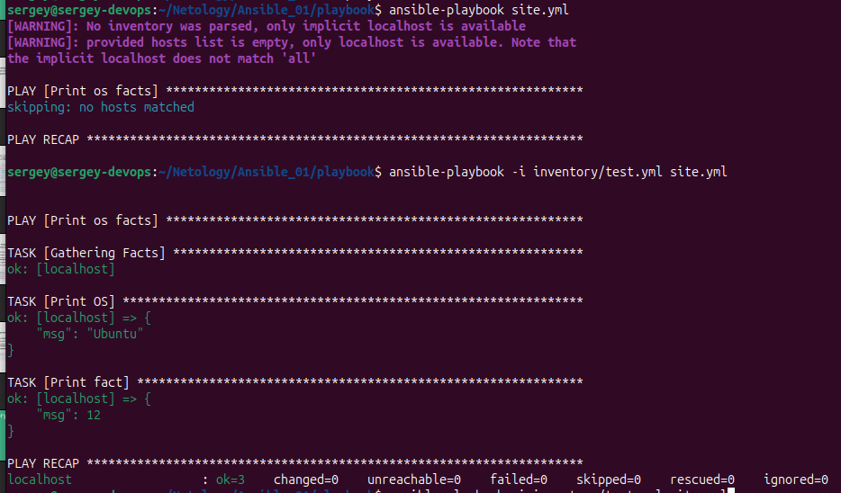

[Задание](https://github.com/netology-code/mnt-homeworks/tree/MNT-video/08-ansible-01-base)

### [Задача 1](tasks/01.md)
Запуск playbook на окружении `test.yml`:  
`ansible-playbook -i inventory/test.yml site.yml`  
  
Значение `some_fact` = 12

### [Задача 2](tasks/02.md)
Указанное значение находится в [`group_vars/all/examp.yml`](/playbook/group_vars/all/examp.yml)

### [Задача 3](tasks/03.md)
Для выполнения этой задачи создадим контейнеры, как указано в [prod.yml](/playbook/inventory/prod.yml):
Для ubuntu создаём [Dockerfile](/playbook/Dockerfile) и поднимаем оба образа:
- `docker build -t ubuntu-python .`
- `docker run -d --name centos7 --hostname centos7 centos:7 sleep infinity`
- `docker run -d --name ubuntu --hostname ubuntu ubuntu-python sleep infinity`
### [Задача 4](tasks/04.md)
- Запускаем `ansible-playbook -i inventory/prod.yml site.yml`
- Результат:  


some_fact для `centos7` = `"el"`, для `ubuntu` = `"deb"`

### [Задача 5](tasks/05.md)
Меняем значение `some_fact` в обоих файлах:  
  

### [Задача 6](tasks/06.md)
Результат:  
  

### [Задача 7](tasks/07.md)
- `ansible-vault encrypt group_vars/el/examp.yml`
- `ansible-vault encrypt group_vars/deb/examp.yml` 

### [Задача 8](tasks/08.md)
`ansible-playbook -i inventory/prod.yml site.yml --ask-vault-password`  
  

### [Задача 9](tasks/09.md)
`ansible-doc --type connection --list`  
  

### [Задача 10](tasks/10.md)
Добавляем новую группу в [prod.yml](/playbook/inventory/prod.yml)  

### [Задача 11](tasks/11.md)
`ansible-playbook -i inventory/prod.yml site.yml --ask-vault-password`  
  

====
## Дополнительные задания

### [Задача 1](tasks/14.md)
`ansible-vault decrypt group_vars/deb/examp.yml`  
`ansible-vault decrypt group_vars/el/examp.yml`  

### [Задача 2](tasks/15.md)
`ansible-vault encrypt_string PaSSw0rd`
  

### [Задача 3](tasks/16.md)
`ansible-playbook -i inventory/prod.yml site.yml --ask-vault-password`  
  
Значение переменной корректное:  
```
ok: [localhost] => {
    "msg": "PaSSw0rd"
}
```

### [Задача 4](tasks/17.md)
Добавляем блок в [prod.yml](/playbook/inventory/prod.yml):  
```
  fedora_group:
    hosts:
      fedora:
        ansible_connection: docker
```
Создаём новую директорию `group_vars/fedora`, в ней файл [prod.yml](/playbook/group_vars/fedora/examp.yml) с содержимым:  
```
---
  some_fact: "fedora_default_fact"
```
Скачиваем образ:
`docker run -d --name fedora --hostname fedora pycontribs/fedora sleep infinity`  
Проверяем контейнеры `docker ps`:  


### [Задача 5](tasks/18.md)
- Пароль пишем в файл `vault_pass` (добавляем в [`.gitignore`](/.gitignore)), чтобы не спрашивал пароль, будем запускать `ansible-playbook` с указанием на файл пароля:  
`ansible-playbook -i inventory/prod.yml site.yml --vault-password-file vault_pass`  
- Пишем [`run.sh`](/playbook/run.sh)  
- Запускаем `./run.sh`  
  
  
